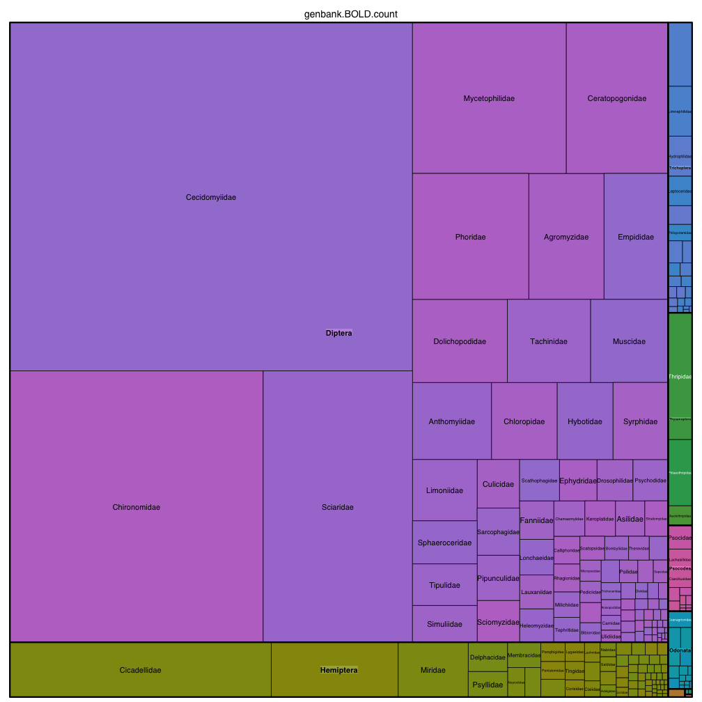

# State of the hexapod tree of life

We are planning to gather info on 458 families.

The code for these analyses is all in https://github.com/bomeara/hexapods. The ROpenSci package `drake` is used to dynamically run analyses to generate content (including this page).

## Binomials per clade in GenBank

## Dark taxa per clade in GenBank

## BOLD taxa per clade in GenBank

## Funding

The core grant for this was NSF [FuturePhy grant ID]. Participation and tools was also supported by grants [GN], [Phylotastic], [more]
