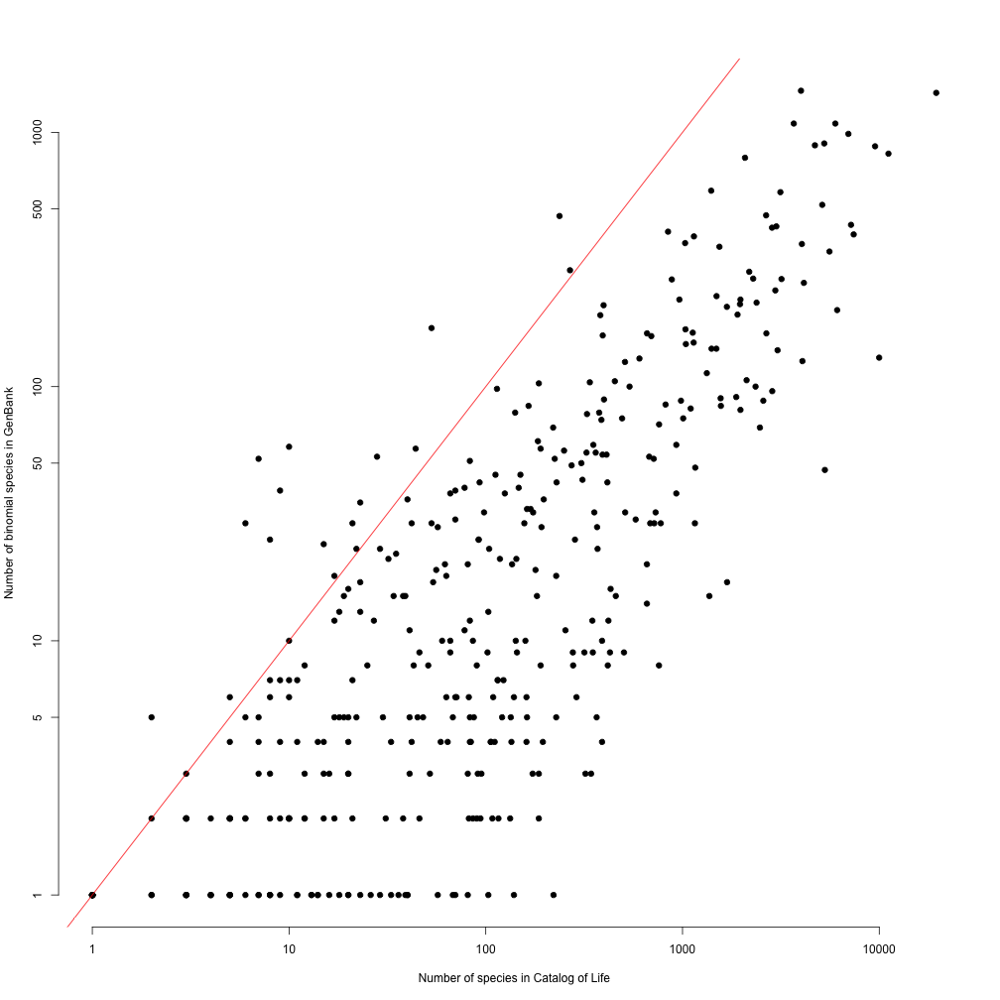

# State of the hexapod tree of life

This is work *in progress* from the Hexapod FuturePhy group (meeting in Chicago, Aug. 1-3, 2018). It will update as we add information.

For example, we are planning to gather info on 458 families so far, but other families will be added.

The code for these analyses is all in https://github.com/bomeara/hexapods. The ROpenSci package `drake` is used to dynamically run analyses to generate content (including this page).

## Binomials per clade in GenBank

## Dark taxa per clade in GenBank

## BOLD taxa per clade in GenBank

## Species in GenBank vs diversity in Catalog of Life

Lines show 100%, 50%, 10% of Catalog of Life species in GenBank (note that this is based on species counts in familes, not 1:1 matching).

## Funding

The core grant for this was NSF [FuturePhy grant ID]. Participation and tools was also supported by grants [GN], [Phylotastic], [more]
